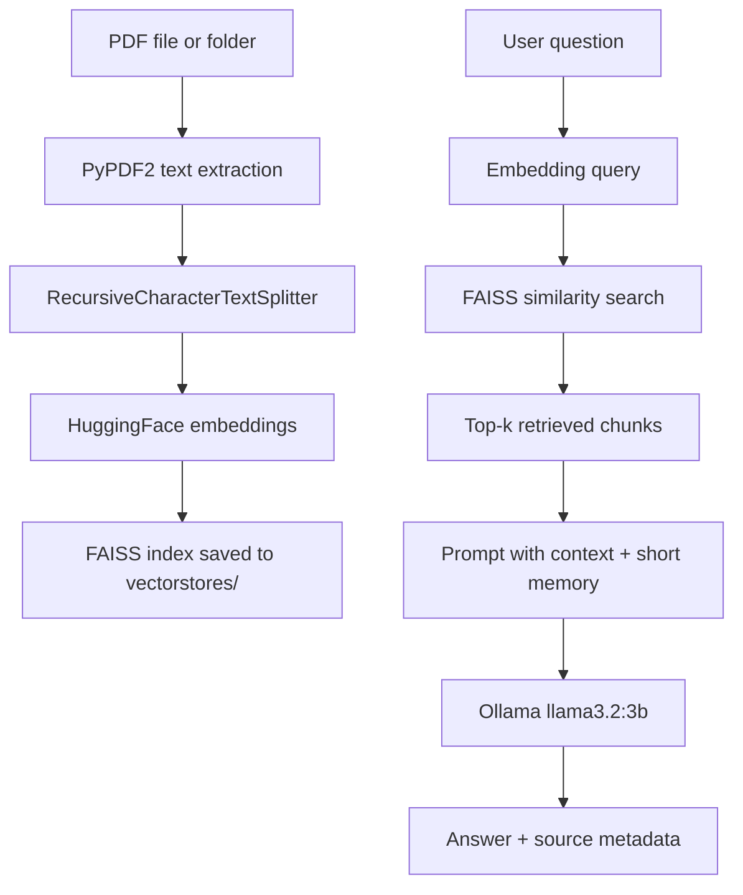

# PDF Reader Chatbot

A local-first retrieval-augmented generation (RAG) chatbot that answers questions about one or more PDF documents. Designed to help individual users understand specialist information.  

## Overview

This project ingests PDFs, splits extracted text into chunks, embeds those chunks, and stores them in a FAISS vector index. At query time, the chatbot retrieves the most relevant chunks and sends them to an Ollama-hosted LLM for grounded answers. I have concentrated on a leightwweight locally run design for personal use cases.

The current implementation prioritizes:

- Local execution and data privacy.
- Simplicity and fast iteration.
- Transparent retrieval with source/page references.

## Current Stack

- LLM runtime: Ollama
- Model: `llama3.2:3b`
- Embeddings: `sentence-transformers/all-MiniLM-L6-v2`
- Vector store: FAISS (local disk)
- PDF parser: PyPDF2
- Text splitting: LangChain `RecursiveCharacterTextSplitter`

## Architecture



## Repository Structure

- `data.py`: PDF loading, chunking, embeddings, and vector index creation.
- `chat.py`: Retrieval + prompt construction + interactive chat loop.
- `llm.py`: Ollama LLM factory.
- `test.py`: Ad-hoc PDF loading checks.
- `vectorstores/`: Persisted FAISS index files.
- `Baking PDFs/`: Example input PDFs.

## How It Works

1. Build embeddings and vector index from PDFs. This uses Tesseract optimal character recognition (OCR) for a robust data collection pipeline as well as the poppler PDF rendering software. OCR is slow at creating vectorbases, this should be investigated
2. Store the FAISS index in `vectorstores/`.
3. Start chatbot loop and ask questions.
4. Retrieve top relevant chunks (`k=3`) and inject into prompt.
5. Return answer and list document sources/pages used. Sources used may not be the most relaevnent. Future work could include retrieving the tpo 5-8 and reranking to give the top 3. 

## Setup

### 1. Create and activate a virtual environment

```powershell
python -m venv .venv
.\.venv\Scripts\Activate.ps1
```

### 2. Install dependencies

```powershell
python -m pip install -r requirements.txt
```

### 3. Install Poppler (required for OCR on PDFs)

`pdf2image` needs the Poppler binary `pdftoppm`.

1. Download and extract Poppler for Windows (zip build).
2. Locate the `Library\\bin` folder that contains `pdftoppm.exe`.
3. Either add that folder to PATH or set `POPPLER_PATH` in your shell:

```powershell
$env:POPPLER_PATH = "C:\poppler\Library\bin"
```

You can verify it with:

```powershell
where.exe pdftoppm
```

### 3b. Install Tesseract OCR (required for OCR text extraction)

Install Tesseract and verify the executable is discoverable:

```powershell
where.exe tesseract
```

If `where.exe` cannot find it, either add the Tesseract install folder to PATH
(for example `C:\Program Files\Tesseract-OCR\` or `C:\Program Files\Tesseract-OCR\bin\`)
or set an explicit path for this session:

```powershell
$env:TESSERACT_CMD = "C:\Program Files\Tesseract-OCR\tesseract.exe"
```

Then restart the terminal/VS Code window so PATH changes are picked up.

### 4. Ensure Ollama is running

Install Ollama, then pull and run the model used by this project:

```powershell
ollama pull llama3.2:3b
```

### 5. Build the vector store

`data.py` currently points to the `Baking PDFs` folder in its `__main__` block.

```powershell
python data.py
```

### 6. Start the chatbot

```powershell
python chat.py
```

## Key Implementation Decisions and Tradeoffs

### 1. Local-first inference with Ollama

- Benefit: Strong privacy and no per-token API cost.
- Tradeoff: Lower model capacity and potentially weaker reasoning than larger hosted models.

### 2. Lightweight embedding model (`all-MiniLM-L6-v2`)

- Benefit: Fast and efficient on consumer hardware.
- Tradeoff: Retrieval quality can degrade on complex or highly domain-specific documents.

### 3. FAISS flat index (simple local persistence)

- Benefit: Easy to build, debug, and run.
- Tradeoff: As corpus size grows, search latency and memory footprint can become limiting.

### 4. Fixed chunking strategy (`chunk_size=500`, `chunk_overlap=100`)

- Benefit: Reliable baseline with predictable behavior.
- Tradeoff: Not optimal for every document layout (tables, long sections, mixed content types).

### 5. Short conversation memory (`MAX_MEMORY_TURNS=6`)

- Benefit: Maintains continuity without unbounded prompt growth.
- Tradeoff: Older context is dropped, which may hurt long sessions.

## Limitations

- OCR pipeline is not wired into ingestion flow yet (image-only PDFs may yield poor extraction).
- Retrieval currently uses similarity search only (no reranking/hybrid retrieval).
- `allow_dangerous_deserialization=True` is used when loading FAISS; treat local index files as trusted artifacts only.
- Minimal automated test coverage at present.

## Roadmap

### Near term

- Add configuration for chunk size, overlap, and top-k at runtime.
- Improve prompt templates and error handling for empty retrieval results.
- Add structured tests for ingestion, retrieval, and prompt assembly.

### Mid term

- Evaluate FAISS IVFPQ or HNSW for larger corpora.
- Add retrieval quality experiments (chunk-size sweeps by document type).
- Integrate OCR fallback path for scanned PDFs.

### Longer term

- Add hybrid retrieval (dense + keyword/BM25).
- Add reranking stage for higher precision contexts.
- Add optional UI layer (for example Streamlit) with source highlighting.

## Suggested Next Improvements

1. Externalize all tunables into a single config file.
2. Add benchmark scripts for retrieval latency and answer quality.
3. Harden index loading and add index version metadata.
4. Introduce CI checks for linting, tests, and reproducible setup.